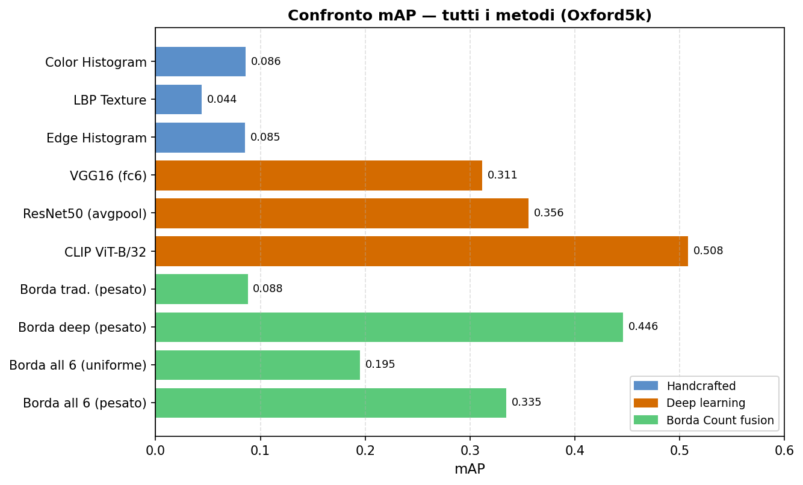
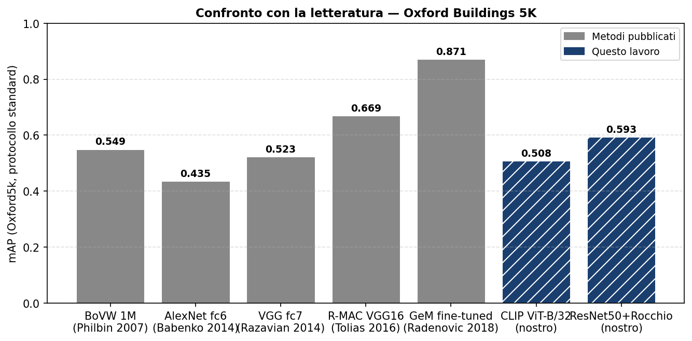
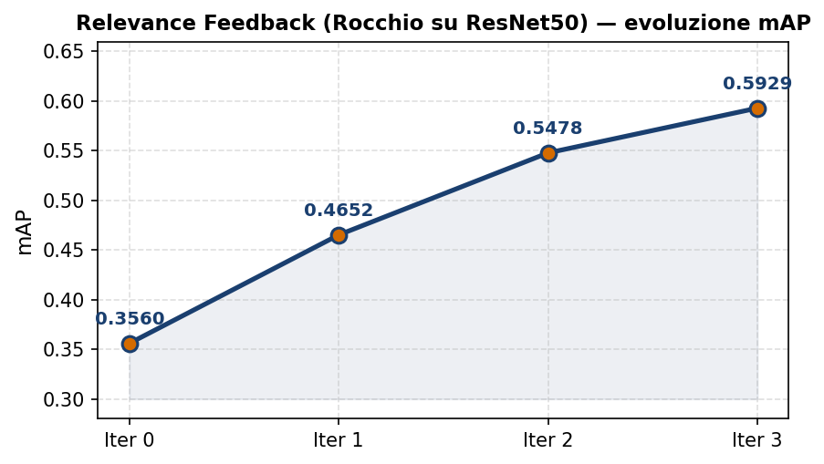
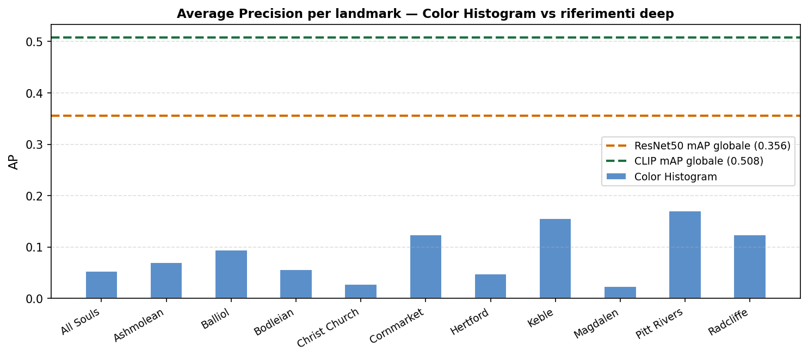

# Sistema CBIR per il retrieval di immagini architettoniche: confronto tra feature tradizionali, deep learning e fusione Borda Count

**Corso**: Visione Artificiale  
**Studente**: Lorenzo Leoni  
**Dataset**: Oxford Buildings 5K

---

## 1. Introduzione al problema

Il progetto sviluppa un sistema di **Content-Based Image Retrieval** (CBIR) applicato al dataset Oxford Buildings 5K. L'obiettivo di un sistema CBIR è recuperare, all'interno di un database, le immagini più simili a una query fornita dall'utente. La ricerca non avviene quindi tramite parole chiave o metadati, ma direttamente a partire dal contenuto visivo delle immagini.

Il caso considerato è particolarmente adatto a questo tipo di analisi: le immagini rappresentano edifici e landmark di Oxford fotografati da punti di vista, distanze, condizioni di illuminazione e livelli di occlusione diversi. In questo scenario, due foto dello stesso edificio possono apparire molto diverse, mentre edifici distinti possono condividere materiali, colori e strutture architettoniche simili. Il problema non è quindi soltanto trovare immagini esteticamente vicine, ma recuperare immagini che rappresentino lo stesso landmark.

Il limite centrale dei sistemi CBIR è il cosiddetto **semantic gap**, cioè la distanza tra ciò che un algoritmo riesce a misurare automaticamente e ciò che un osservatore umano interpreta come significato dell'immagine. Un istogramma colore può rilevare che due immagini hanno una distribuzione cromatica simile, ma non sa distinguere se entrambe rappresentano la Radcliffe Camera oppure due edifici diversi costruiti con pietra chiara. Allo stesso modo, una texture può descrivere pattern locali come finestre o mattoni, ma non necessariamente l'identità dell'edificio.

Per questo motivo il progetto non si limita a un singolo descrittore, ma confronta più livelli di rappresentazione:

1. **Feature tradizionali**, come colore, texture ed edge, utili per capire quanto le informazioni low-level siano sufficienti.
2. **Feature locali**, basate su SIFT e Bag of Visual Words, che cercano dettagli architettonici più specifici.
3. **Feature deep**, estratte da VGG16, ResNet50 e CLIP, che rappresentano l'immagine in spazi più semantici.
4. **Fusione dei ranking**, tramite Borda Count, per valutare se descrittori diversi possano compensare reciprocamente i propri limiti.
5. **Relevance feedback** e **Visual RAG**, come estensioni orientate a scenari più interattivi e applicativi.

L'impostazione comparativa evita di assumere a priori che il deep learning sia sempre la soluzione migliore. Il progetto misura il guadagno ottenuto passando da descrittori semplici a rappresentazioni più avanzate e individua anche i casi in cui una feature apparentemente debole conserva un contributo informativo.

---

## 2. Stato dell'arte

### 2.1 Feature tradizionali per CBIR

I primi sistemi CBIR si basavano su descrittori progettati manualmente, spesso indicati come **handcrafted features**. Questi descrittori sono interpretabili e relativamente semplici da calcolare, ma catturano soprattutto caratteristiche visive di basso livello.

Gli **istogrammi colore**, introdotti da Swain e Ballard, rappresentano la distribuzione dei colori in un'immagine. Sono molto efficienti e robusti rispetto a piccoli cambiamenti locali, ma ignorano quasi completamente la disposizione spaziale. Due immagini con gli stessi colori, ma con oggetti disposti in modo diverso, possono risultare molto simili.

I **Local Binary Pattern** (LBP) descrivono la texture confrontando ogni pixel con i suoi vicini. Sono adatti a rappresentare pattern ripetitivi, come mattoni, superfici in pietra, finestre o decorazioni, tutti elementi frequenti nelle immagini architettoniche. Il loro limite è che descrivono bene la struttura locale, ma non sempre distinguono l'identità globale dell'edificio.

Gli **edge histogram** sintetizzano la distribuzione dei bordi e dei loro orientamenti. Per edifici e landmark l'informazione geometrica è rilevante, perché facciate, colonne, archi e tetti generano strutture di bordo riconoscibili. Tuttavia, gli edge sono sensibili al punto di vista e alla presenza di occlusioni.

Infine, il modello **Bag of Visual Words** (BoVW), derivato dall'information retrieval testuale, rappresenta un'immagine come insieme di parole visive ottenute da descrittori locali SIFT. Questo approccio è storicamente importante perché è stato applicato con successo proprio a benchmark di object e landmark retrieval, incluso Oxford Buildings.

### 2.2 Feature deep learning

Con il deep learning, il retrieval visuale ha iniziato a usare feature apprese da reti neurali pre-addestrate. Invece di progettare manualmente cosa misurare, si sfruttano rappresentazioni imparate su grandi dataset.

**VGG16** produce feature dense ad alta dimensionalità e rappresenta una baseline classica per il transfer learning. È una rete relativamente semplice nella struttura, ma i layer fully-connected intermedi contengono informazioni visive di livello più alto rispetto a colore o texture.

**ResNet50** introduce le residual connections, che permettono di addestrare reti più profonde. Il vettore ottenuto dal global average pooling è più compatto di quello di VGG16 e spesso più robusto, perché sintetizza attivazioni più profonde della rete.

**CLIP** rappresenta un passaggio ulteriore: non è addestrato soltanto a classificare immagini, ma a mettere in relazione immagini e testo nello stesso spazio vettoriale. Nel progetto questo permette di usare lo stesso modello sia per il retrieval image-to-image sia per quello text-to-image. CLIP, quindi, non confronta solo somiglianze visive, ma tende a catturare anche concetti semantici associati all'immagine.

### 2.3 Fusione di ranking

Quando più descrittori producono ranking diversi, una possibilità è combinarli. L'idea è semplice: se due feature osservano aspetti diversi dell'immagine, i loro errori potrebbero non coincidere. Una feature basata sul colore può funzionare bene su edifici cromaticamente distintivi, mentre una feature deep può essere più stabile su variazioni di scala e punto di vista.

Nel progetto è stato scelto il **Borda Count**, un metodo di fusione basato sulla posizione nel ranking. La ragione principale è legata alle scale dei punteggi: intersezione tra istogrammi, distanza chi-squared e similarità coseno non sono direttamente confrontabili. Una somma dei punteggi avrebbe richiesto normalizzazioni aggiuntive e potenzialmente arbitrarie. Il Borda Count evita questo passaggio perché utilizza solo l'ordine dei risultati.

### 2.4 Relevance feedback

Il **relevance feedback** introduce l'utente nel ciclo di retrieval. Dopo un primo ranking, l'utente indica quali risultati sono rilevanti e quali no; il sistema aggiorna la query per avvicinarsi ai risultati positivi e allontanarsi da quelli negativi. Nel progetto questo processo viene simulato usando il ground truth del dataset, così da misurare il guadagno potenziale del feedback senza richiedere interazione manuale.

Questa parte considera uno scenario più vicino all'uso reale: non sempre il primo ranking deve essere definitivo. Se il sistema è interattivo, anche un risultato iniziale non ottimale può essere raffinato progressivamente.

### 2.5 Visual RAG e allucinazioni nei VLM

I Vision-Language Model, come BLIP-2, sono in grado di descrivere immagini e rispondere a domande visive. Tuttavia, possono produrre risposte plausibili ma errate, soprattutto quando devono identificare un landmark specifico; per questo motivo si parla spesso di allucinazioni anche nel dominio visivo.

Per ridurre questo problema, il progetto sperimenta un'estensione **Visual RAG**: il CBIR recupera immagini simili dal database, estrae un'indicazione sul landmark più probabile e fornisce questa informazione come contesto al VLM. In questo modo il modello non risponde soltanto sulla base della propria conoscenza interna, ma viene ancorato a evidenza recuperata da un database verificato.

---

## 3. Approccio sviluppato

### 3.1 Architettura generale del sistema

La pipeline è stata progettata in modo modulare. Ogni descrittore estrae una rappresentazione dell'immagine, produce un ranking rispetto alla query e viene valutato con lo stesso protocollo. In questo modo il confronto rimane controllato: cambiano le feature, ma non cambiano dataset, query o metriche.

```text
Immagine query con ROI
        |
        v
Estrazione feature
        |
        v
Calcolo similarità e ranking per ciascun descrittore
        |
        v
Valutazione singola feature
        |
        v
Fusione Borda Count e analisi dei risultati
```

Per le query viene usata la **ROI** fornita dal ground truth, cioè il bounding box che delimita il landmark da cercare. Nelle immagini di Oxford Buildings possono comparire cielo, strada, persone, alberi o altri edifici; estrarre la feature dall'intera immagine rischierebbe quindi di confrontare elementi non rilevanti. Il crop della ROI concentra il confronto sul landmark.

### 3.2 Feature estratte

Sono state implementate sette feature, raggruppate in tre categorie.

**Feature tradizionali**:

| Feature | Dimensione | Metodo | Similarità |
|---------|------------|--------|------------|
| Color Histogram | 4096 | Istogramma HSV 3D, 16 bin per canale | Intersezione |
| LBP Texture | 555 | LBP uniform, P=24 e R=3 | Chi-squared |
| Edge Histogram | 128 | Gradienti Sobel, griglia 4x4, 8 orientamenti | Coseno |

**Feature locali**:

| Feature | Dimensione | Metodo | Similarità |
|---------|------------|--------|------------|
| SIFT + BoVW | 5000 | Vocabolario visuale con k-means e pesatura TF-IDF | Coseno |

**Feature deep**:

| Feature | Dimensione | Architettura | Similarità |
|---------|------------|-------------|------------|
| VGG16 | 4096 | Layer fc6, pre-trained ImageNet | Coseno |
| ResNet50 | 2048 | Global average pooling, pre-trained ImageNet V2 | Coseno |
| CLIP ViT-B/32 | 512 | Vision Transformer, pre-trained LAION-2B | Coseno |

Le feature sono state scelte per coprire livelli di descrizione diversi. L'obiettivo non era soltanto ottenere il miglior numero finale, ma costruire un confronto interpretabile. Colore, texture ed edge rappresentano tre aspetti intuitivi dell'immagine; BoVW aggiunge dettagli locali; VGG16 e ResNet50 permettono di valutare rappresentazioni CNN off-the-shelf; CLIP introduce una rappresentazione più semantica e multimodale.

### 3.3 Motivazione delle scelte implementative

Per il **colore** è stato scelto lo spazio HSV invece di RGB, perché separa tinta, saturazione e luminosità. In Oxford Buildings una stessa facciata può apparire più chiara, più scura o più satura a seconda dell'orario, del meteo e della fotocamera. L'intersezione tra istogrammi è stata preferita perché misura la sovrapposizione tra distribuzioni, ed è quindi adatta a istogrammi normalizzati.

Per la **texture** è stato usato LBP uniform con un raggio più ampio rispetto alla configurazione base. Le texture architettoniche non sono sempre micro-pattern a livello di pixel: pietre, mattoni, finestre e decorazioni hanno spesso una scala più ampia. La variante uniform riduce la dimensionalità e mantiene i pattern più frequenti, come zone uniformi, bordi e angoli.

Per gli **edge** è stata introdotta una griglia 4x4. Un istogramma globale degli orientamenti avrebbe perso completamente la disposizione spaziale dei bordi; al contrario, dividere l'immagine in celle permette di conservare una forma approssimata del layout. È un compromesso: la rappresentazione resta semplice e compatta, ma non ignora del tutto dove compaiono le strutture.

La feature **SIFT + BoVW** rappresenta un passaggio intermedio tra descrittori semplici e deep learning. SIFT individua punti locali salienti ed è robusto a scala e rotazione, caratteristiche rilevanti quando lo stesso edificio è fotografato da angolazioni diverse. Il vocabolario visuale trasforma un numero variabile di descrittori locali in un vettore confrontabile, mentre la pesatura TF-IDF riduce il peso di pattern troppo comuni, come cielo, strada o dettagli generici.

Per le feature deep, **VGG16** e **ResNet50** sono state usate come feature extractor senza fine-tuning. Il confronto resta così coerente con uno scenario in cui non si addestra un modello specializzato sul dataset. VGG16 fornisce una baseline storica; ResNet50 offre una rappresentazione più profonda e compatta. **CLIP** cambia invece la natura del sistema: oltre al retrieval image-to-image, abilita anche query testuali, ad esempio descrizioni come "a round domed building in Oxford".

### 3.4 Fusione con Borda Count

La fusione Borda Count combina i ranking assegnando più peso alle immagini che appaiono in posizioni alte. Sono state testate due varianti: una uniforme, in cui ogni feature conta allo stesso modo, e una pesata, in cui il contributo di ciascuna feature è proporzionale al suo mAP individuale.

La variante pesata nasce dall'idea che una feature sistematicamente più affidabile debba influenzare maggiormente il risultato finale. I risultati mostrano però che questo non basta sempre: quando feature molto deboli vengono fuse con feature molto forti, anche un peso ridotto può introdurre rumore sufficiente a degradare il ranking.

### 3.5 Relevance Feedback con Rocchio

Il relevance feedback è stato applicato sulle feature ResNet50. Rocchio modifica direttamente il vettore query, spostandolo verso i risultati positivi e lontano dai negativi. Questa operazione ha più senso in uno spazio vettoriale continuo, come quello prodotto da una CNN profonda, rispetto a descrittori più rigidi come istogrammi colore o LBP.

Nel notebook il feedback è simulato usando il ground truth: tra i primi risultati recuperati, quelli appartenenti alle liste good o ok vengono trattati come positivi, gli altri come negativi. Questa simulazione non rappresenta un'interfaccia utente reale, ma permette di stimare quanto il sistema potrebbe migliorare se l'utente fornisse feedback corretto.

### 3.6 Text-to-Image retrieval con CLIP

CLIP consente di codificare testo e immagini nello stesso spazio. Per questo motivo, oltre al classico retrieval image-to-image, è stato implementato anche un retrieval text-to-image. Una descrizione testuale viene trasformata in embedding e confrontata con gli embedding delle immagini del database.

Questa funzionalità amplia il modo in cui il sistema può essere interrogato. Un utente potrebbe non avere un'immagine query, ma sapere cosa cerca: ad esempio un edificio con una cupola, un college gotico o un ponte. Le feature tradizionali e le CNN classiche non permettono questo tipo di interrogazione senza un modulo aggiuntivo di comprensione linguistica.

### 3.7 Visual RAG

La parte Visual RAG usa il CBIR come componente di grounding per BLIP-2. Il sistema recupera le top-k immagini più simili tramite CLIP, associa le immagini recuperate ai landmark noti usando una knowledge base costruita dai ground truth e determina il landmark più probabile tramite voto di maggioranza.

Il contesto così ottenuto viene passato a BLIP-2 insieme alla domanda. Il voto di maggioranza riduce la dipendenza dal primo risultato: un falso positivo in prima posizione potrebbe guidare il VLM verso una risposta sbagliata, mentre l'accordo tra più risultati tra i primi dieci fornisce una stima di confidenza più stabile.

---

## 4. Valutazione sperimentale

### 4.1 Dataset, protocollo e metriche

Il dataset **Oxford Buildings 5K** contiene immagini di edifici e landmark di Oxford raccolte da Flickr. Le query sono 55, organizzate in 11 landmark con 5 query per landmark. Per ogni query sono disponibili un'immagine, una ROI e liste di immagini classificate come good, ok e junk.

Nel calcolo delle metriche, le immagini **good** e **ok** sono considerate rilevanti. Le immagini **junk** vengono ignorate, come previsto dal protocollo standard: non sono conteggiate né come positive né come negative, perché rappresentano casi ambigui o con visibilità insufficiente.

La metrica principale è il **mAP** (mean Average Precision), standard per questo benchmark. Sono state inoltre calcolate **P@1**, **P@5** e **P@10**, che misurano la qualità dei primi risultati. In un sistema di retrieval reale questo aspetto pesa molto, perché l'utente osserva soprattutto le prime immagini restituite.

### 4.2 Risultati delle singole feature

| Metodo | Tipo | Dim. | mAP | P@1 | P@5 | P@10 |
|--------|------|------|-----|-----|-----|------|
| Color Histogram (HSV) | Handcrafted | 4096 | 0.0860 | 0.7818 | 0.2145 | 0.1400 |
| LBP Texture | Handcrafted | 555 | 0.0441 | 0.2182 | 0.0982 | 0.0891 |
| Edge Histogram | Handcrafted | 128 | 0.0852 | 0.4909 | 0.2255 | 0.1764 |
| SIFT + BoVW (TF-IDF) | Locale | 5000 | 0.2252 | 0.8182 | 0.4873 | 0.3836 |
| VGG16 (fc6) | CNN | 4096 | 0.3114 | 0.7273 | 0.5564 | 0.4564 |
| ResNet50 (avgpool) | CNN | 2048 | 0.3560 | 0.7818 | 0.5345 | 0.4491 |
| CLIP ViT-B/32 | ViT | 512 | **0.5080** | **0.8182** | **0.6909** | **0.5873** |



I risultati seguono una progressione netta. Le feature tradizionali hanno mAP basso, ma non sono da scartare: il colore, ad esempio, raggiunge una P@1 elevata, quindi in diversi casi il primo risultato è corretto anche se il ranking complessivo decade rapidamente. È coerente con la natura del descrittore: quando il landmark ha colori distintivi funziona bene, ma lungo tutto il database non discrimina a sufficienza.

LBP è la feature più debole. Probabilmente la sola texture non basta a distinguere edifici architettonicamente simili, soprattutto quando facciate diverse condividono pattern di finestre, pietra e decorazioni. Gli edge hanno prestazioni simili al colore in termini di mAP, ma una P@1 più bassa, segno che la geometria globale è utile ma molto sensibile al punto di vista.

SIFT + BoVW migliora sensibilmente rispetto alle feature globali, segno che i dettagli locali sono più informativi del solo aspetto globale. BoVW non usa deep learning, ma raggiunge comunque una P@1 pari a CLIP. Il limite è il mAP più basso: il primo risultato è spesso buono, ma il ranking completo non mantiene la stessa qualità.

Tra le feature deep, ResNet50 supera VGG16 in mAP, pur avendo una dimensionalità inferiore. CLIP ottiene il risultato migliore, con un salto evidente rispetto alle CNN classiche. Questo suggerisce che l'addestramento contrastivo immagine-testo produce rappresentazioni più adatte a catturare l'identità semantica dei landmark.

### 4.3 Confronto con la letteratura

| Metodo | Riferimento | mAP |
|--------|-------------|-----|
| BoVW (1M visual words) | Philbin et al., CVPR 2007 | 0.549 |
| CNN off-the-shelf (AlexNet fc6) | Babenko et al., ECCV 2014 | 0.435 |
| CNN off-the-shelf (VGG fc7) | Razavian et al., CVPR-W 2014 | 0.523 |
| R-MAC VGG16 (senza fine-tuning) | Tolias et al., ICLR 2016 | 0.669 |
| GeM VGG16 (con fine-tuning) | Radenovic et al., CVPR 2018 | 0.871 |
| **SIFT + BoVW 5K words (nostro)** | - | **0.225** |
| **CLIP ViT-B/32 (nostro, zero-shot)** | - | **0.508** |
| **ResNet50 + Rocchio iter.3 (nostro)** | - | **0.593** |



Il confronto con la letteratura va interpretato con attenzione. I metodi più avanzati, come GeM, sono progettati specificamente per il landmark retrieval e spesso sfruttano fine-tuning o pooling regionali ottimizzati. Il progetto, invece, utilizza feature off-the-shelf e non addestra modelli sul dominio.

Il divario tra il BoVW implementato e quello di Philbin è atteso: il lavoro originale usa vocabolari molto più grandi e include verifica geometrica, mentre qui è stato scelto un vocabolario da 5000 parole visive per mantenere il sistema più leggero e gestibile. CLIP zero-shot, invece, si avvicina alle baseline CNN della letteratura senza alcun adattamento specifico, confermando la forza delle rappresentazioni multimodali.

### 4.4 Fusione Borda Count

| Metodo di fusione | mAP | P@1 | P@5 | P@10 |
|-------------------|-----|-----|-----|------|
| Borda (4 tradizionali+locali, pesato) | 0.1726 | 0.6727 | 0.3673 | 0.2873 |
| Borda (3 deep, pesato) | **0.4462** | **0.8545** | **0.6945** | **0.5909** |
| Borda (tutte 7, uniforme) | 0.2462 | 0.7818 | 0.4582 | 0.3527 |
| Borda (tutte 7, pesato) | 0.3678 | 0.8364 | 0.5673 | 0.4527 |

La fusione produce un risultato meno lineare del previsto. La fusione delle sole feature deep migliora le metriche di precisione nelle prime posizioni, ma non supera il mAP di CLIP singolo. La fusione di tutte le feature, invece, peggiora rispetto a CLIP.

La complementarità, da sola, non basta. Feature diverse possono commettere errori diversi, ma se alcune sono troppo deboli introducono rumore nel ranking. Anche nella variante pesata, le feature tradizionali e BoVW possono spingere verso l'alto immagini non rilevanti, riducendo il vantaggio delle feature deep. Il Borda Count funziona meglio quando i descrittori hanno qualità comparabile, mentre è meno adatto quando vengono fuse rappresentazioni molto eterogenee.

### 4.5 Relevance Feedback



| Iterazione | mAP | Delta vs baseline |
|-----------|-----|-------------------|
| 0 (baseline) | 0.3560 | - |
| 1 | 0.4652 | +0.1093 |
| 2 | 0.5478 | +0.1918 |
| 3 | **0.5929** | **+0.2369** |

Il relevance feedback è uno dei risultati più forti del progetto. Partendo da ResNet50, che da sola raggiunge mAP 0.3560, tre iterazioni di Rocchio portano a mAP 0.5929. Il miglioramento è consistente e coinvolge quasi tutte le query: nel notebook 54 query su 55 migliorano dopo il feedback.

Un sistema interattivo può quindi compensare una rappresentazione iniziale non perfetta. Se i primi risultati contengono almeno qualche immagine corretta, il feedback fornisce un segnale concreto su come spostare la query nello spazio delle feature. Il limite resta evidente: se nei primi risultati non compare nessun positivo, il feedback ha poco materiale utile e può anche peggiorare leggermente il ranking.

### 4.6 Visual RAG

| Metodo | Accuratezza (11 landmark) |
|--------|--------------------------|
| VLM solo (BLIP-2, baseline) | 0% (0/11) |
| CBIR voting (solo retrieval) | **100%** (11/11) |
| VLM + Visual RAG | **100%** (11/11) |

Nel test Visual RAG, BLIP-2 senza contesto non identifica correttamente i landmark. Le sue risposte sono spesso descrittive ma generiche, ad esempio "a castle", "Oxford college" o "the old library". Il modello mostra quindi capacità visive generali, ma non una conoscenza fattuale precisa sui landmark del dataset.

Con il contesto recuperato dal CBIR, invece, la risposta viene ancorata a un candidato specifico. Il voto di maggioranza sulle immagini recuperate identifica correttamente tutti gli 11 landmark testati, e il VLM usa questa informazione per produrre risposte corrette. Il test resta limitato a un benchmark chiuso, quindi non va letto come garanzia generale; indica però che il retrieval può ridurre risposte generiche o inventate quando il database contiene esempi pertinenti.

### 4.7 Principali cause d'errore

Le feature tradizionali falliscono soprattutto quando landmark diversi condividono lo stesso materiale e colori simili. Molti edifici di Oxford sono costruiti in pietra chiara, quindi l'istogramma colore tende a confondere edifici cromaticamente vicini. Il colore funziona meglio quando il landmark presenta caratteristiche cromatiche distintive, come nel caso di Keble College.

LBP risulta debole perché la texture architettonica è spesso ripetitiva e condivisa tra edifici diversi. Finestre, pietra, mattoni e decorazioni possono generare pattern locali simili anche quando i landmark sono differenti.

Gli edge catturano informazioni sulla struttura, ma risentono fortemente del punto di vista. La stessa facciata vista frontalmente o lateralmente produce una distribuzione dei bordi diversa. Inoltre, alberi, persone o veicoli possono introdurre bordi non legati al landmark.

BoVW è più discriminativo perché lavora su dettagli locali, ma la quantizzazione in parole visive può fondere pattern diversi nello stesso cluster. Un vocabolario più ampio e una verifica geometrica potrebbero ridurre questo problema.

Le CNN off-the-shelf sono più robuste, ma sono addestrate su ImageNet per classificare categorie generali, non per distinguere istanze specifiche di edifici. CLIP riduce questo limite grazie alla componente semantica, ma può ancora confondere edifici descrivibili con concetti simili, come chiese o college gotici.



### 4.8 Discussione dei risultati

Dai risultati emerge una gerarchia chiara tra rappresentazioni. Le feature handcrafted sono interpretabili ma insufficienti per un retrieval affidabile su tutto il dataset. Le feature locali migliorano perché catturano dettagli architettonici specifici. Le CNN portano una rappresentazione più astratta e stabile. CLIP ottiene il miglior risultato perché combina informazione visiva e semantica appresa da dati multimodali.

Il punto non è soltanto che CLIP sia il migliore. Anche metodi meno recenti restano competitivi in alcune condizioni. SIFT + BoVW ha una P@1 pari a CLIP, segno che i dettagli locali contano ancora quando il primo match è il criterio principale. Inoltre, il colore batte le feature deep su alcune query di Keble College, dove l'aspetto cromatico è particolarmente distintivo.

La fusione Borda Count conferma che combinare feature conviene solo se i segnali sono sufficientemente affidabili. Aggiungere feature deboli non significa necessariamente aggiungere informazione: può significare aggiungere rumore. Dal punto di vista progettuale, questo suggerisce di selezionare con attenzione i descrittori da fondere o di usare metodi di fusione più adattivi.

Il relevance feedback mette invece in evidenza il valore dell'interazione. In uno scenario applicativo, un sistema che migliora dopo il feedback dell'utente può essere più efficace di un sistema statico. Questo vale soprattutto per il retrieval, dove l'obiettivo non è classificare una volta per tutte, ma aiutare l'utente a esplorare un database.

Infine, il Visual RAG usa il CBIR non solo come sistema di ricerca, ma come componente di grounding per modelli generativi. Il CBIR fornisce al VLM una memoria esterna controllata e verificabile.

---

## 5. Conclusioni e possibili sviluppi futuri

### 5.1 Conclusioni

Il progetto ha confrontato sette descrittori su un problema di landmark retrieval, partendo da feature semplici e arrivando a rappresentazioni deep e multimodali. Il passaggio da descrittori low-level a feature apprese riduce progressivamente il semantic gap, ma ogni rappresentazione conserva punti di forza specifici.

Le feature tradizionali sono limitate, ma permettono di interpretare bene alcune cause di successo e fallimento. BoVW dimostra che i keypoint locali restano competitivi, soprattutto nelle prime posizioni del ranking. Le CNN migliorano il retrieval grazie a rappresentazioni più astratte, mentre CLIP ottiene il miglior compromesso complessivo e introduce la possibilità di query testuali.

La fusione Borda Count ha dato risultati utili dal punto di vista analitico: funziona meglio quando combina feature di qualità simile, ma può peggiorare quando include descrittori molto deboli. Questo chiarisce che la fusione non deve essere applicata in modo automatico, ma richiede selezione e pesatura attente.

Il relevance feedback è risultato particolarmente efficace: partendo da ResNet50, tre iterazioni di Rocchio superano il mAP di CLIP singolo. Questo suggerisce che, in applicazioni interattive, la possibilità di correggere progressivamente la query può valere più dell'uso di un descrittore iniziale più potente.

La parte Visual RAG mostra infine che il retrieval può supportare i Vision-Language Model riducendo risposte generiche o errate. Invece di chiedere al VLM di riconoscere un landmark in modo open-world, il CBIR restringe il problema a un insieme di candidati recuperati dal dataset.

### 5.2 Possibili sviluppi futuri

- **Pooling regionali per CNN**: introdurre R-MAC o GeM per ottenere feature più adatte al landmark retrieval rispetto al global average pooling.
- **PCA-whitening**: applicare decorrelazione e riduzione di dimensionalità alle deep feature per migliorare la discriminatività e ridurre il rumore.
- **Query expansion**: usare i primi risultati più affidabili come query aggiuntive, migliorando il recall senza richiedere feedback esplicito.
- **Re-ranking geometrico**: sfruttare i keypoint SIFT già estratti per verificare la coerenza spaziale tra query e risultati tramite RANSAC.
- **Fusione più adattiva**: sostituire o affiancare Borda Count con metodi che stimino l'affidabilità delle feature per ciascuna query.
- **Fine-tuning su dataset di landmark**: addestrare o adattare modelli deep su dati più vicini al dominio architettonico.
- **Object-Level Visual RAG**: estendere il retrieval a regioni o oggetti specifici, ad esempio cupole, torri, archi o facciate, per fornire al VLM un grounding più fine.

---

## Riferimenti

- Swain, M. J., & Ballard, D. H. (1991). Color indexing. *International Journal of Computer Vision*.
- Ojala, T., Pietikäinen, M., & Mäenpää, T. (2002). Multiresolution gray-scale and rotation invariant texture classification with local binary patterns. *IEEE TPAMI*.
- Sivic, J., & Zisserman, A. (2003). Video Google: A text retrieval approach to object matching in videos. *ICCV*.
- Simonyan, K., & Zisserman, A. (2014). Very deep convolutional networks for large-scale image recognition. *ICLR*.
- He, K., Zhang, X., Ren, S., & Sun, J. (2015). Deep residual learning for image recognition. *CVPR*.
- Tolias, G., Sicre, R., & Jégou, H. (2016). Particular object retrieval with integral max-pooling of CNN activations. *ICLR*.
- Radford, A., et al. (2021). Learning transferable visual models from natural language supervision. *ICML*.
- Li, J., et al. (2023). BLIP-2: Bootstrapping language-image pre-training with frozen image encoders and large language models. *ICML*.
- Rocchio, J. J. (1971). Relevance feedback in information retrieval. *The SMART Retrieval System*.
- Philbin, J., et al. (2007). Object retrieval with large vocabularies and fast spatial matching. *CVPR*.
- Babenko, A., et al. (2014). Neural codes for image retrieval. *ECCV*.
- Razavian, A. S., et al. (2014). CNN features off-the-shelf: An astounding baseline for recognition. *CVPR Workshops*.
- Radenovic, F., et al. (2018). Revisiting Oxford and Paris: Large-scale image retrieval benchmarking. *CVPR*.
